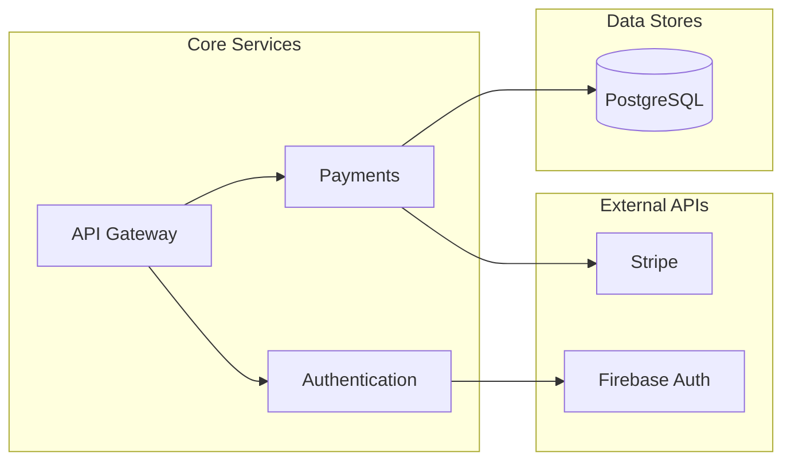

<p align="center">
  
</p>

<h1 align="center">🌑 Umbra</h1>

<p align="center">
  <strong>The Shadow Architect</strong><br>
  AI-powered architecture diagrams that update in real-time as you code.
</p>

<p align="center">
  <a href="https://pypi.org/project/umbra-architect/"></a>
  <a href="https://pypi.org/project/umbra-architect/"></a>
  <a href="https://github.com/rida12b/Umbra/blob/main/LICENSE"></a>
  <a href="https://github.com/rida12b/Umbra/stargazers"></a>
</p>

<p align="center">
  <a href="#-the-problem">Problem</a> •
  <a href="#-the-solution">Solution</a> •
  <a href="#-quick-start">Quick Start</a> •
  <a href="#-features">Features</a> •
  <a href="#-demo">Demo</a>
</p>

---

## 😰 The Problem

You're using **Cursor**, **Copilot**, or **ChatGPT** to write code faster than ever. But there's a catch:

> **You no longer understand your own codebase.**

- Documentation is always outdated
- Architecture diagrams are lies
- New team members are lost
- You forgot what that service does

## 💡 The Solution

**Umbra** watches your code and maintains a **living architecture diagram** that updates automatically.

```
Save file → Umbra detects → AI analyzes → Diagram updates
```

No more manual documentation. No more outdated diagrams. Just code.

## 🚀 Quick Start

### 1. Install

```bash
pip install umbra-architect
```

### 2. Configure

Get a free API key from [Google AI Studio](https://aistudio.google.com/apikey), then:

```bash
# Set your API key
export GOOGLE_API_KEY="your-api-key"

# Or create a .env file in your project
echo "GOOGLE_API_KEY=your-api-key" > .env
```

### 3. Run

```bash
cd your-project
umbra watch .
```

That's it! Open `output/LIVE_ARCHITECTURE.md` to see your architecture.

## ✨ Features

| Feature | Description |
|---------|-------------|
| 🔍 **Smart Analysis** | AI understands semantic changes, not just syntax |
| 📊 **Live Diagrams** | Mermaid.js diagrams update in real-time |
| 📝 **Auto Summary** | Natural language project description |
| 🌐 **HTML Export** | Share beautiful standalone reports |
| 🐍 **Python Support** | Full Python codebase analysis |
| ⚛️ **JS/TS Support** | React, Next.js, Express, and more |
| ⚡ **Fast** | Under 5 seconds per analysis |
| 🔒 **Read-Only** | Never modifies your code |

## 🎬 Demo

### Before: 40 files, no clue what's happening

```
my-project/
├── src/
│   ├── services/
│   │   ├── auth.py
│   │   ├── payments.py
│   │   ├── notifications.py
│   │   └── ...20 more files
│   ├── api/
│   └── utils/
└── ???
```

### After: Clear architecture in seconds



Plus a human-readable summary:

> **Type:** FastAPI Backend  
> **Stack:** Python, PostgreSQL, Stripe, Firebase  
> **What it does:** E-commerce API with authentication and payment processing

## 📖 Commands

| Command | Description |
|---------|-------------|
| `umbra watch .` | Scan project + watch for changes |
| `umbra watch . --no-scan` | Watch only (skip initial scan) |
| `umbra scan .` | One-time full scan |
| `umbra export report.html` | Export to interactive HTML |
| `umbra init` | Create empty architecture file |

## 🛠️ Configuration

Create a `.env` file in your project:

```env
GOOGLE_API_KEY=your-api-key
GEMINI_MODEL=models/gemini-flash-latest
OUTPUT_FILE=./output/LIVE_ARCHITECTURE.md
DEBOUNCE_SECONDS=2
```

## 🤔 How It Works

1. **Watch** - Monitors your files for changes (Python, JS, TS)
2. **Analyze** - AI determines if the change is structural or cosmetic
3. **Update** - Only structural changes update the diagram
4. **Visualize** - Mermaid diagram renders in VS Code or browser

### What's "structural"?

| ✅ Updates Diagram | ❌ Ignored |
|-------------------|-----------|
| New service class | Renaming variables |
| External API call | Adding comments |
| Database connection | Formatting code |
| Inter-service communication | Test files |

## 🗺️ Roadmap

### Current (v0.2)
- [x] Python support
- [x] JavaScript/TypeScript support
- [x] Project summaries
- [x] HTML export

### Coming Soon
- [ ] VS Code extension
- [ ] CI/CD integration (generate on PR)

### Future Vision
- [ ] **AI Code Analysis** - Find bugs and issues automatically
- [ ] **Auto-Fix Suggestions** - AI-powered code corrections
- [ ] **Team Collaboration** - Share architecture across team
- [ ] **Custom Rules** - Define what's "structural" for your project

## 🤝 Contributing

Contributions are welcome! See [CONTRIBUTING.md](CONTRIBUTING.md) for guidelines.

```bash
# Clone
git clone https://github.com/rida12b/Umbra.git
cd Umbra

# Install
poetry install

# Test
poetry run pytest
```

## 📜 License

MIT License - see [LICENSE](LICENSE) for details.

---

<p align="center">
  <strong>Stop documenting. Start understanding.</strong>
</p>

<p align="center">
  <a href="https://github.com/rida12b/Umbra">⭐ Star us on GitHub</a>
</p>
